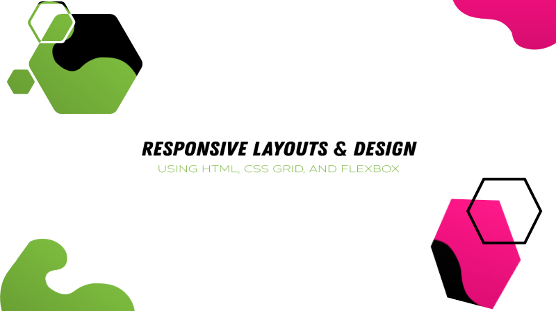

# Responsive Layouts & Design

Welcome to Responsive Layouts & Design Workshop, a project with beginners and aspiring developers in mind. Utilizing HTML, CSS Grid, and Flexbox to achieve a simplistic yet elegant website for the greatest start up of all time; Keiko Corp.

## Project Brief

Incredibly, Bruno the CEO of Keiko Corp has built the fastest growing tech start up in Silicon Valley, without ever having launched a website. Bruno's marketing team is insisting that they need a website in order to gain the confidence of the potential clients to reach this quarters sales targets.

## Getting Started

1. First up you need to fork (make a copy) this repo to your Github account.
2. Clone (download) your fork to your computer.
3. There are two branches start and finish in the project. We will be working from the start branch to get to where the finish branch is.

## Workshop Resources

- [Codepen Profile](https://codepen.io/bdesignedwebdev)
- [GitHub repo start](https://github.com/brittneypostma/workshop-keiko-corp/tree/start)
- [GitHub repo finish](https://github.com/brittneypostma/workshop-keiko-corp)

## Additional Resources

- [Mobile Friendly Test](https://search.google.com/test/mobile-friendly)
- [Web and Mobile Design: Zero to Mastery](https://academy.zerotomastery.io/p/academy?utm_source=github&utm_campaign=keiko-corp-hf20&affcode=441520_gjue7n-1)
- [Complete Web Developer: Zero to Mastery - Advanced CSS Lectures](https://academy.zerotomastery.io/courses/697434/lectures/12738267?affcode=441520_gjue7n-1)
- [CSS Remedy](https://github.com/jensimmons/cssremedy)
- [The Complete Guide to Grid - CSS Tricks](https://css-tricks.com/snippets/css/complete-guide-grid/)
- [CSS Layout Patterns](https://csslayout.io/patterns/)
- [One Line Layouts - Una Kravets](https://web.dev/one-line-layouts/)
- [Free CSS Grid Course - Wes Bos](https://cssgrid.io/)

## Disclaimer

Keiko Corp is a fictitious company, initially fabricated back in 2018 to enrich the learning process for the students of the Junior to Senior course. Keiko Corp, Bruno & his impeccable hair have since featured in several [Zero To Mastery](https://academy.zerotomastery.io/p/academy?utm_source=github&utm_campaign=keiko-corp-hf20&affcode=441520_gjue7n-1) courses becoming the favorite topic of conversation amongst students.
